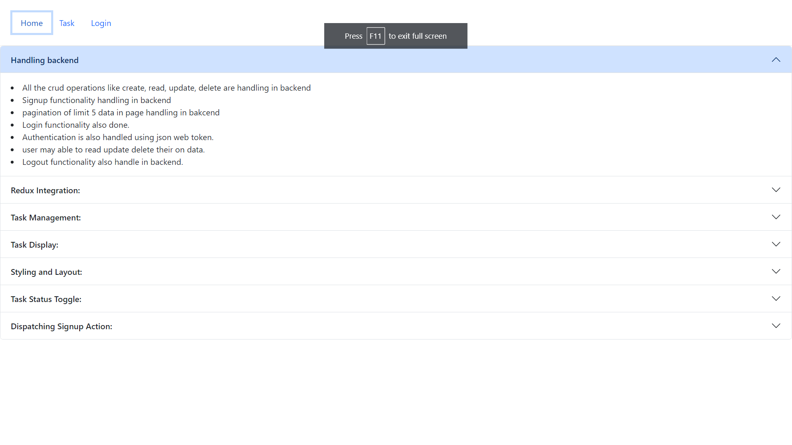
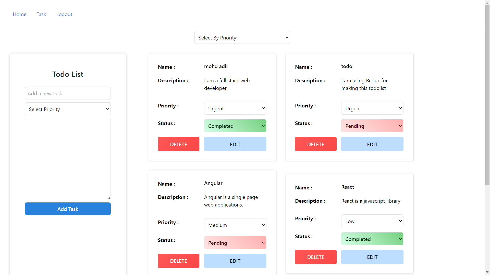
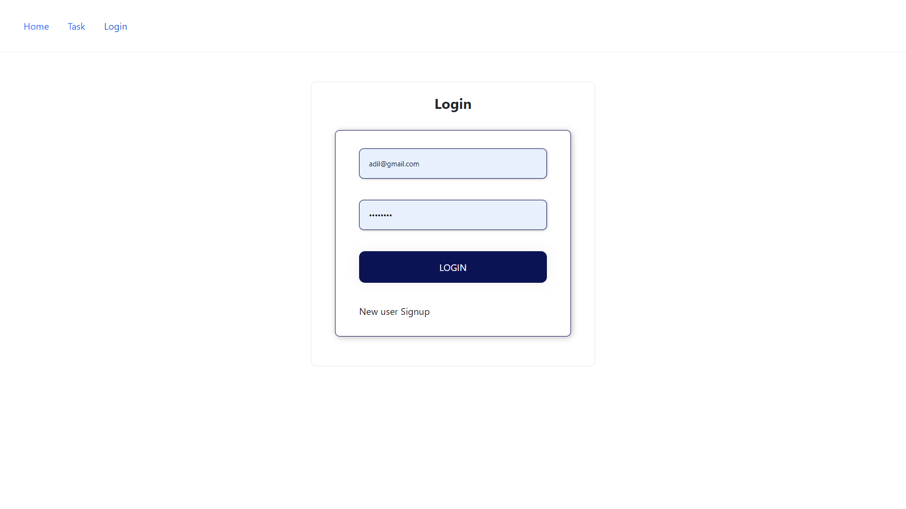
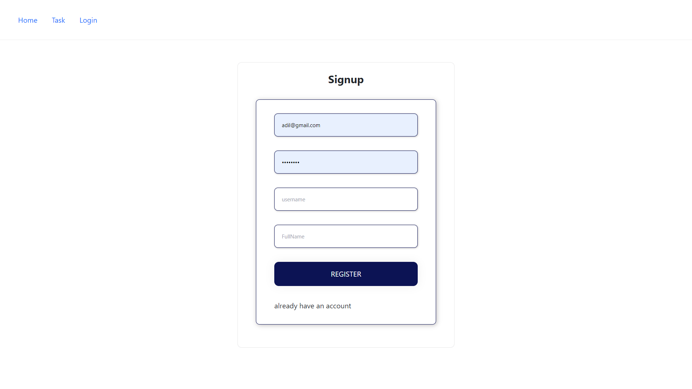

# Task Management App

 This task management app  allows us to add tasks and able to see their own tasks.

 video : https://drive.google.com/file/d/1s4YDIe1kms81JGhPc0mfVv6iLVIcHiGk/view?usp=drive_link

## Table of Contents

- [About](#about)
- [Features](#features)
- [Getting Started](#getting-started)
- [Usage](#usage)
- [Technologies Used](#technologies-used)
- [Deployment](#deployment)
- [Contributing](#contributing)
- [License](#license)

## About

Task management app is a web application designed to add delete update the tasks.

## Features

- User authentication.
- Login and Signup functionality.
- user can only see or make crud operation on their own tasks.
- add tasks , delete tasks , get tasks implemented.
- backend handle for CRUD operation.
- backend handle for login signup and logout.
- navigation also applied in ui.
- toast used for error and success message.
- Home page where all the features are described.
- filter by pririty is also implemented.

## Screenshots

## Deployment

Deployed Link: https://task-management-two-henna.vercel.app/

## Getting Started

# Clone the repository

https://github.com/mohdadil12345/Task_Management_

# Change directory

cd your-repo

# Install dependencies

npm install

# Start the development server

npm run server

## Technologies Used

- Task Management app  is built using the following technologies:

- React.js
- Tailwind CSS
- Axios
- JavaScript
- css
- backend api
- Redux
- toast
- Bootstrap

## Usage

- Visit the application in your web browser at https://task-management-two-henna.vercel.app/

## Note:- Register and Login first to visit the tasks page
